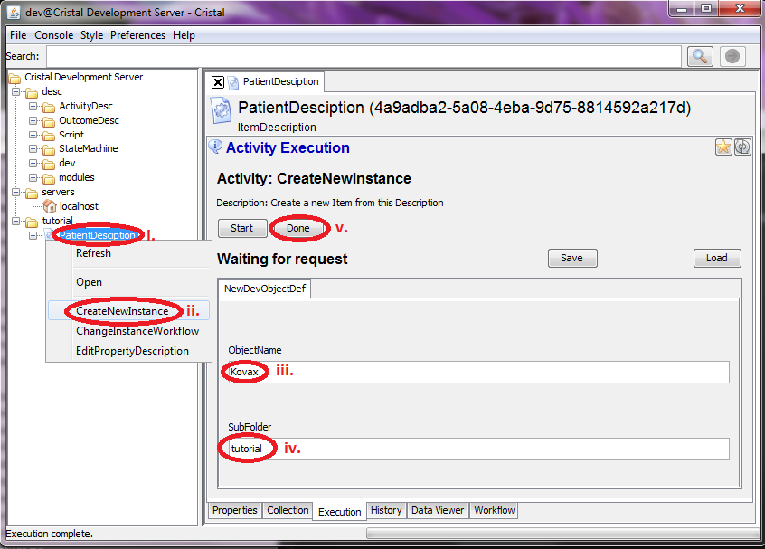
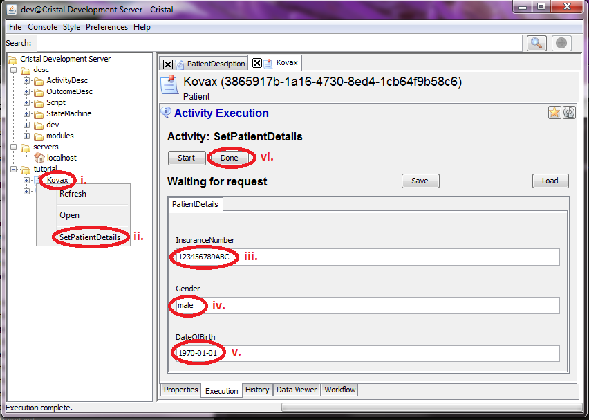

### Sequence of actions using the Cristalise GUI to create 'Kovax' Patient Item

1. Use `PatientDescription` Item to excecute `CreateNewInstance` Activity 
    1. Select `/tutorial/PatientDescription` in the tree browser
    1. Right-click on the icon and select Activity `CreateNewInstance`
    1. Type `Kovax` into input field `ObjectName` 
    1. Type `tutorial` into input field `SubFolder`
    1. Push `Done` button

1. Use `Kovax` Patient Item to excecute `SetPatientDeatils` Activity 
    1. Select `/tutorial/Kovax` in the tree browser
    1. Right-click on the icon and select Activity `SetPetientDetails`
    1. Type `` into input field `InsuranceNumber` 
    1. Type `male` into input field `Gender` 
    1. Type `1970.01.01` into input field `DateOfBirth`
    1. Push `Done` button

- **Prev:** [Create `PatientDescription` Description Item](../Create-PatientDescription)
- **Top:**  [Main page](../Basic-Tutorial)