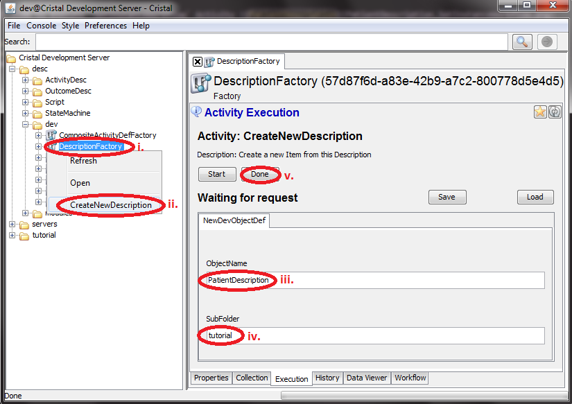
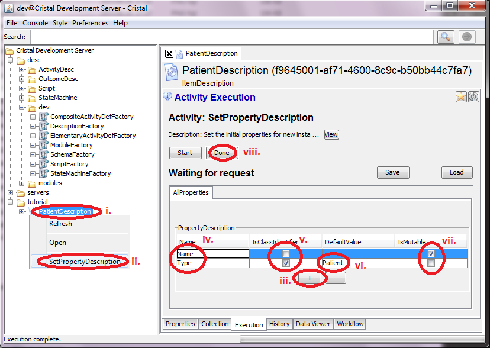
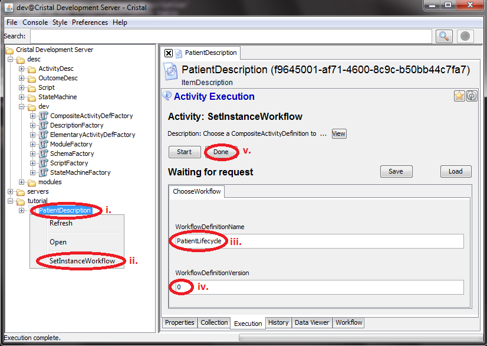

### Sequence of actions using the Cristalise GUI to create `PatientDescription` Description Item

1. Use `DescriptionFactory` Item to excecute `CreateNewDescription` Activity 
    1. Select `/desc/dev/DescriptionFactory` in the tree browser
    1. Right-click on the icon and select Activity `CreateNewDescription`
    1. Type `PatientDescription` into input field `ObjectName` 
    1. Type `tutorial` into input field `SubFolder`
    1. Push `Done` button

1. Use `PatientDescription` Item to execute `SetPropertyDescription` Activity 
    1. Select `/tutorial/PatientDescription` in the tree browser
    1. Right-click on the icon and select Activity `SetPropertyDescription`
    1. Push `+` button to have two rows in the PropertyDescription table
    1. Set the `Name` column for the 2 rows to Name and Type respectively
    1. Set the `IsClassIdentifier` checkbox of Type row
    1. Type `Patient` to the `DefaultValue` column of Type row
    1. Set the `IsMutable` checkbox of Name row
    1. Push `Done` button

1. Use `PatientDescription` Item to execute `SetInstanceWorkflow` Activity 
    1. Select `/tutorial/PatientDescription` in the tree browser
    1. Right-click on the icon and select Activity `SetInstanceWorkflow`
    1. Type `PatientLifecycle` into input field `WorkflowDefinition` 
    1. Type `0` into input field `WorkflowDefinitionVersion`
    1. Push `Done` button

- **Next:** [Create `Kovax` Patient Item](../Create-Patient)
- **Prev:** [Create `PatientLifecycle` CompositeActivity Description Item](../Create-PatientLifecycle)
- **Top:**  [Main page](../Basic-Tutorial)