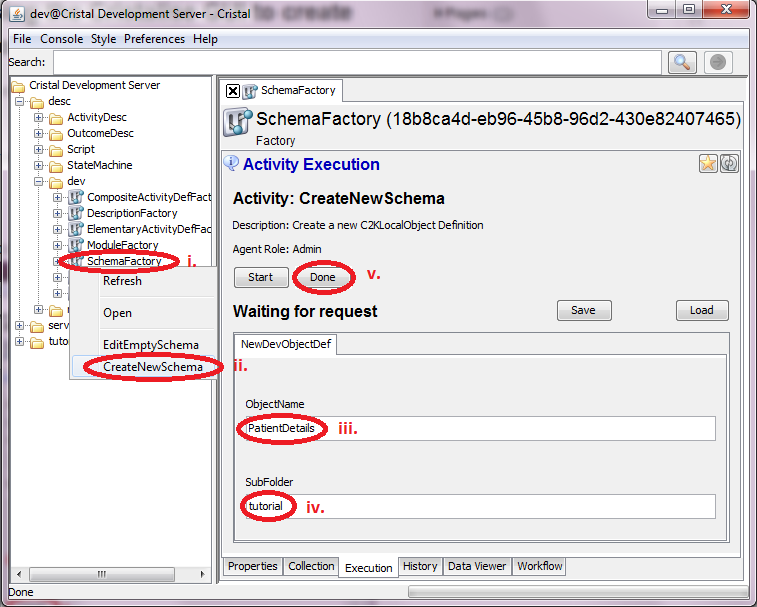
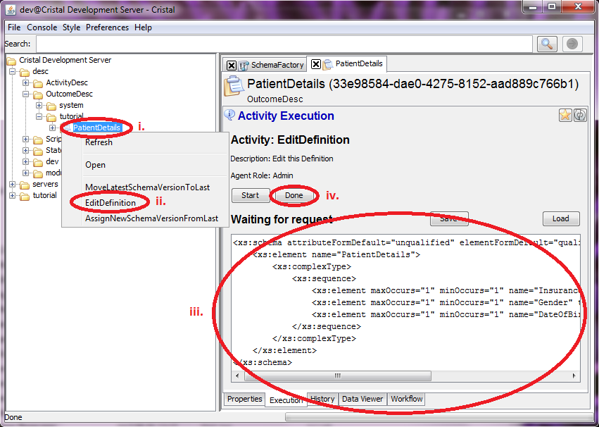
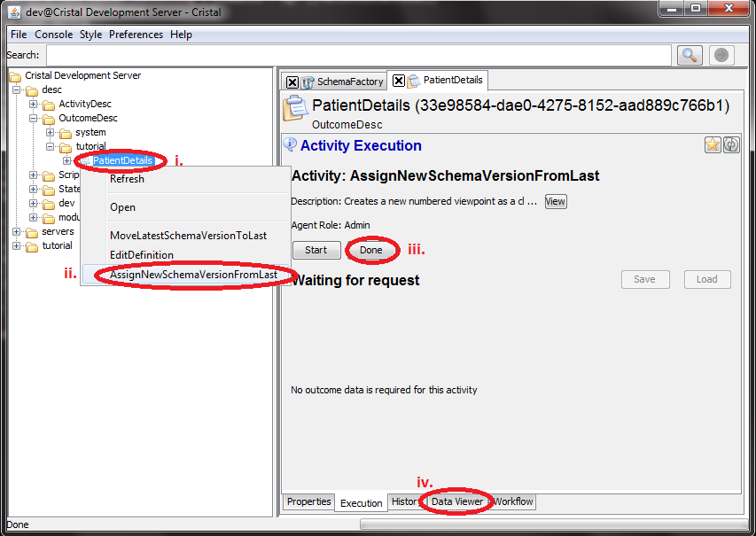
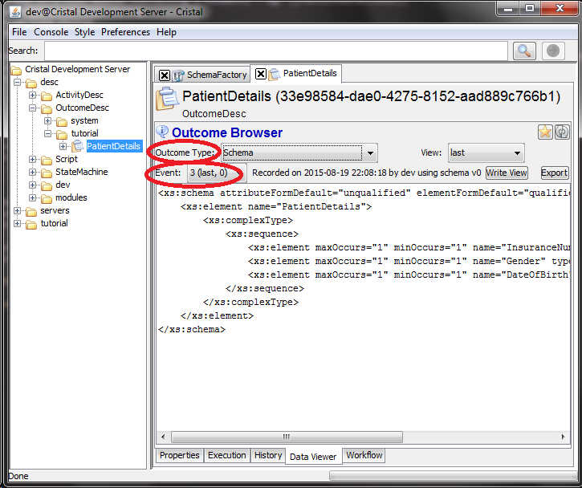

### Sequence of actions using the Cristalise GUI to create `PatientDetails` OutcomeDesc (Schema) 

1. Create an XSD in a text editor containing 3 elements - eg: [[PatientDetailsXSD]]
    - InsuranceNumber of type string
    - Gender of type string
    - DateOfBirth of type string

1. Use `SchemaFactory` Item to execute `CreateNewSchema` Activity 
    1. In the tree browser open the `desc` folder then the `dev` folder to reveal the `SchemaFactory` Item
    1. Right-click on `SchemaFactory` and select Activity `CreateNewSchema`
    1. Type `PatientDetails` into input field `ObjectName` 
    1. Type `tutorial` into input field `SubFolder`
    1. Push `Done` button 

1. Use `PatientDetails` Item to execute `EditDefinition` Activity 
    1. Select `/desc/OutcomeDesc/tutorial/PatientDetails` in the tree browser
    1. Right-click on the icon and select Activity `EditDefinition`
    1. Copy the content of [[PatientDetailsXSD]] to the textbox
    1. Push `Done` button 

1. Create the version 0 of the Schema 
    1. Select `/desc/OutcomeDesc/tutorial/PatientDetails` in the tree browser
    1. Right-click on the icon and select `AssignNewSchemaVersionFromLast` 
    1. Push `Done` button. Version 0 of the PatientDetails schema has now been created. 
    1. You can view it as View 0 of the 'Schema' outcome in the Data Viewer tab.

- **Next:** [Create `SetPatientDetails` Activity Description Item](../Create-SetPatientDetails)
- **Top:**  [Main page](../Basic-Tutorial)