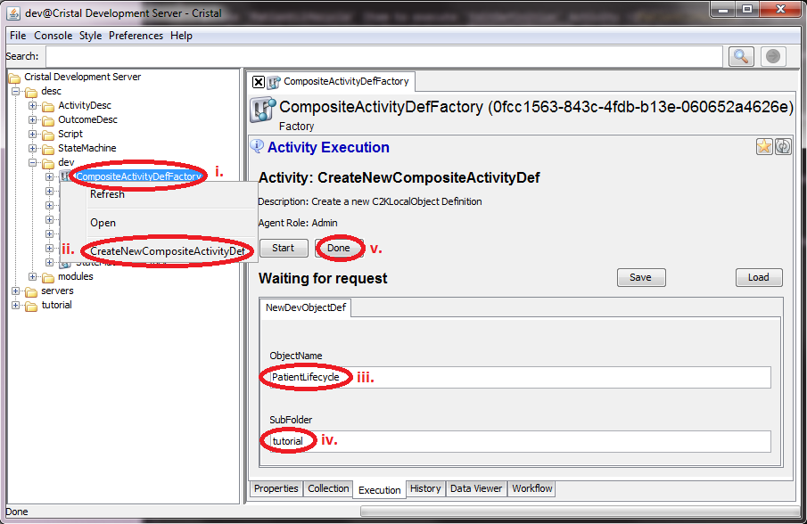
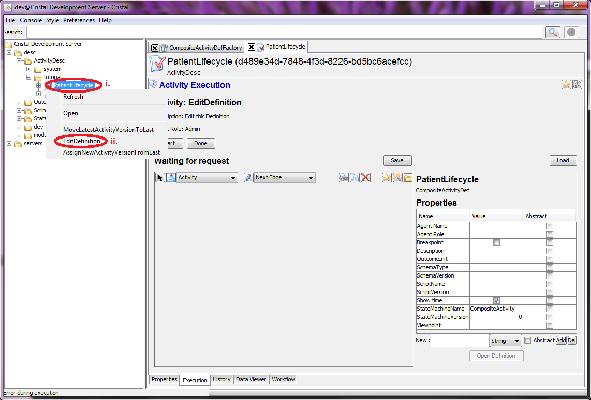
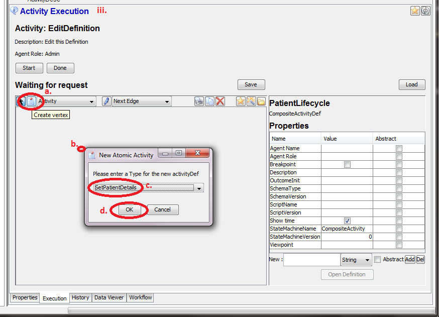
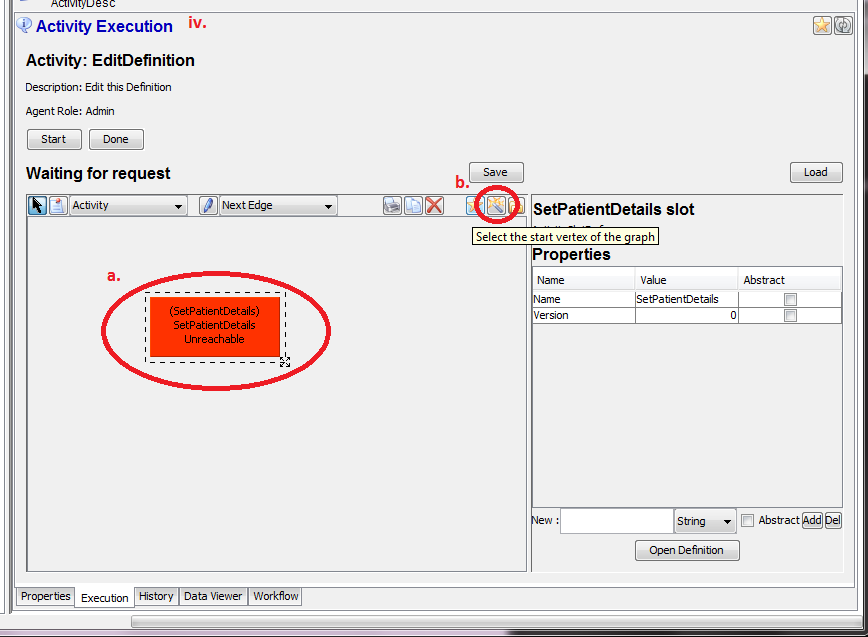
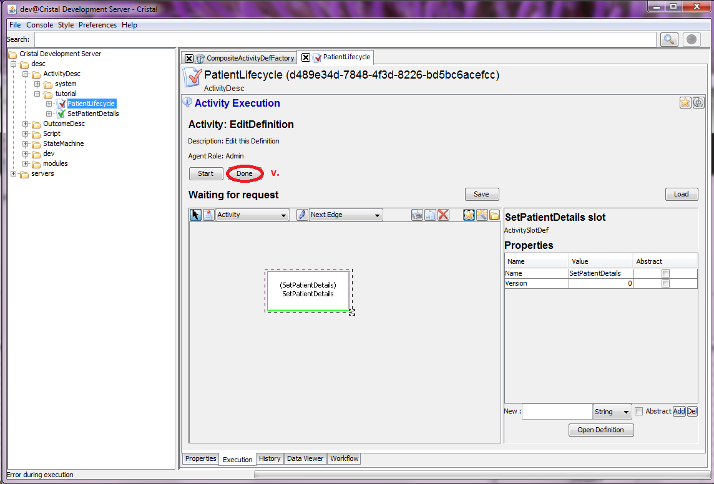
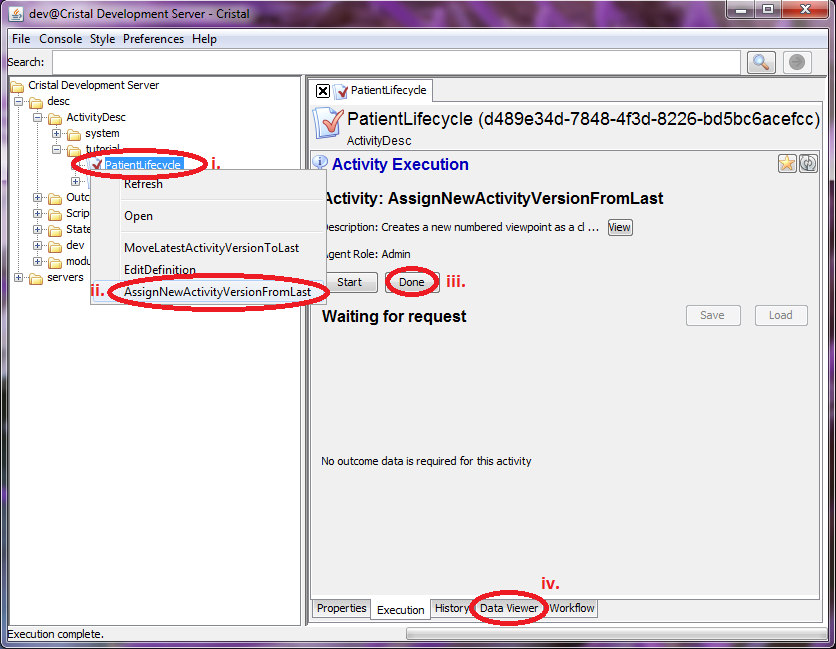
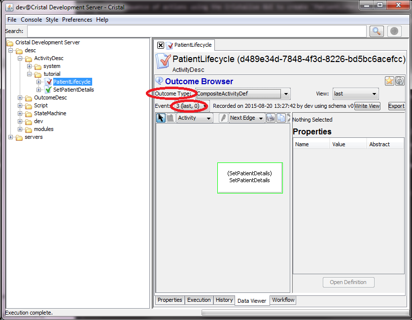

### Sequence of actions using the Cristalise GUI to create `PatientLifecycle` CompositeActivityDesc

1. Use `CompositeActivityDefFactory` Item to excecute `CreateNewCompositeActivityDef` Activity 
    1. Select `/desc/dev/CompositeActivityDefFactory` in the tree browser
    1. Right-click on the icon and select Activity `CreateNewCompositeActivityDef`
    1. Type `PatientLifecycle` into input field `ObjectName` 
    1. Type `tutorial` into input field `SubFolder`
    1. Push `Done` button 

1. Use `PatientLifecycle` Item to execute `EditDefinition` Activity 
    1. Select `/desc/ActivityDesc/tutorial/PatientLifecycle` in the tree browser
    1. Right-click on the icon and select Activity `EditDefinition`
    1. Edit the CompositeActivty layout 
        1. Click on the Create vertex icon (second icon from the left)
        1. Click on big canvas. It opens the `New Atomic Activity` Window
        1. Select `SetPatientDetails` Activity from the list
        1. Click OK
    1. Set the new Activity as start vertex 
        1. Click on the Activity rectangle in red
        1. Clikc in the magic wand icon (second from right) to set Activity to be first vertex. It shall change the colour to green
    1. Push `Done` button  

1. Create the version 0 of the ActitityDesc 
    1. Select `/desc/ActivityDesc/tutorial/PatientLifecycle` in the tree browser
    1. Right-click on the icon and select `AssignNewSchemaVersionFromLast` 
    1. Push `Done` button
	1. Select `Data Viewer` tab
	1. Select `Outcome type = CompositeActivityDef` and check (last, 0) properties of Event 3. The main section shall show the layout of your newly created workflow 

- **Next:** [Create `PatientDescription` Description Item](Create-PatientDescription)
- **Prev:** [Create `SetPatientDetails` Activity Description Item](Create-SetPatientDetails)
- **Top:**  [Main page](Basic-Tutorial)