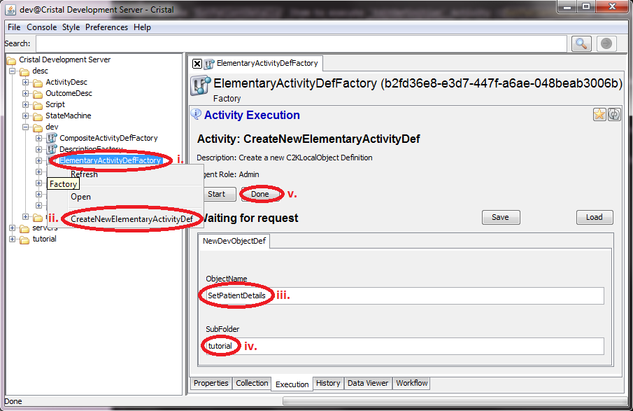
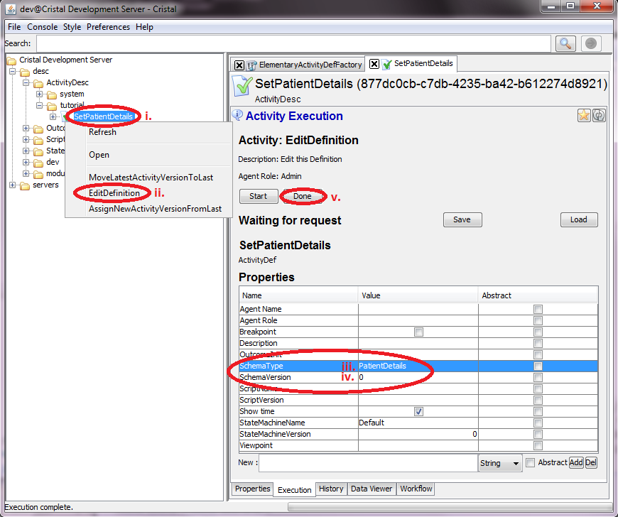
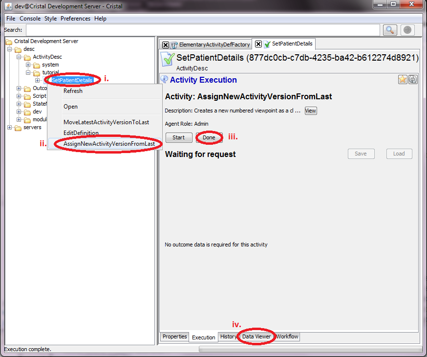
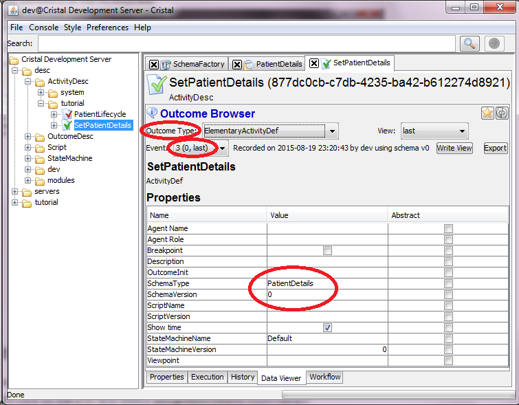

### Sequence of actions using the Cristalise GUI to create `SetPatientDetails` ActivityDesc

1. Use `ElementaryActivityDefFactory` Item to excecute `CreateNewElementaryActivityDef` Activity 
    1. Select `/desc/dev/ElementaryActivityDefFactory` in the tree browser
    1. Right-click on the icon and select Activity `CreateNewElementaryActivityDef`
    1. Type `SetPatientDetails` into input field `ObjectName` 
    1. Type `tutorial` into input field `SubFolder`
    1. Push `Done` button 

1. Use `SetPatientDetails` Item to execute `EditDefinition` Activity 
    1. Select `/desc/ActivityDesc/tutorial/SetPatientDetails` in the tree browser
    1. Right-click on the icon and select Activity `EditDefinition`
    1. Type `PatientDetails` into input field `SchemaType`
    1. Type `0` into input field `SchemaVersion`
    1. Push `Done` button

1. Create the version 0 of the ActitityDesc 
    1. Select `/desc/ActivityDesc/tutorial/SetPatientDetails` in the tree browser
    1. Right-click on the icon and select `AssignNewSchemaVersionFromLast` 
    1. Push `Done` button
	1. Select `Data Viewer` tab 
	1. Select `Outcome Type = ElementaryActivityDef` and check (last, 0) properties of Event 3. You should also see the Propeties of the Avtivity you have set earlier 

- **Next:** [Create `PatientLifecycle` CompositeActivity Description Item](Create-PatientLifecycle)
- **Prev:** [Create `PatientDetails` OutcomeDesc Item](Create-PatientDetails)
- **Top:**  [Main page](Basic-Tutorial)