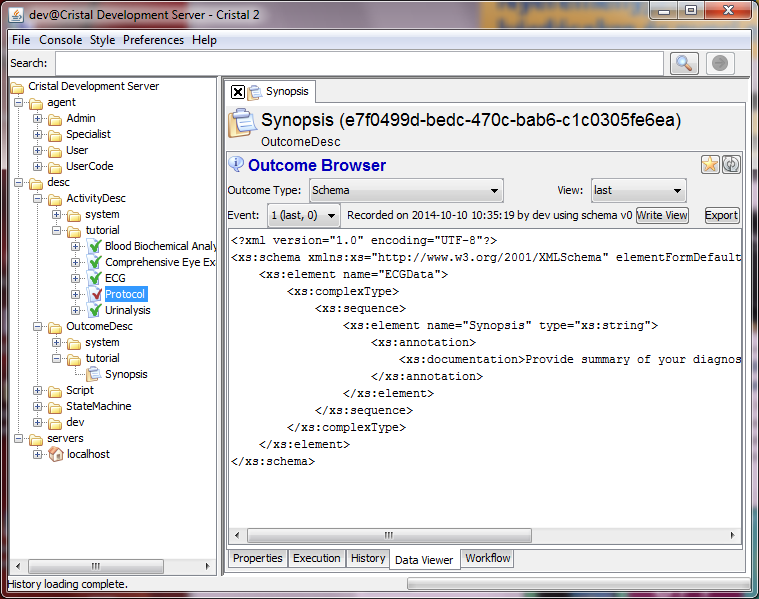

Sequence of actions using the Cristalise GUI
--------------------------------------------

### Create Outcome Definition (Schema) and 4 Elementary Activities Definitions

For the sake of simplicity the same Schema is assigned to all Activities and all Activities will be executed manually by a User.

1. Open /dev/SchemaFactory Item
   1. `Excecute CreateNewSchema ObjectName:Synopsis SubFolder:tutorial`
   1. Open /desc/OutcomeDesc/tutorial/Synopsis Item
       1. `Execute EditDefinition` and copy the content of Synopsis.xsd attached to the text
       1. `Execute AssignNewSchemaVersionFromLast` - this creates the version 0 of the Schema
       1. Check (last, 0) properites of Event 1 for Outcome Type Schema in Data Viewer

1. Open /dev/ElementaryActivityDefFactory Item
   - `Excecute CreateNewElementaryActivityDef ObjectName:ECG SubFolder:tutorial`
   - `Excecute CreateNewElementaryActivityDef ObjectName:'Blood Biochemical Analysis' SubFolder:tutorial`
   - `Excecute CreateNewElementaryActivityDef ObjectName:'Urinalysis' SubFolder:tutorial`
   - `Excecute CreateNewElementaryActivityDef ObjectName:'Comprehensive Eye Examination' SubFolder:tutorial`
   - Check that there are 4 Activity Decription Items created in /desc/ActivityDesc/tutorial

1. Open Elementary Activites listed bellow in /desc/ActivityDesc/tutorial and perform these steps for each of them
   - activity - role pairs 
       - Blood Biochemical Analysis - Hematologist
       - Urinalysis - Internist
       - ECG - Cardiologist
       - Comprehensive Eye Examination - Opthometrist

   1. `Execute EditDefinition AgentRole:ROLENAME SchemaType:Synopsis SchemaVersion:0`
   1. `Execute AssignNewSchemaVersionFromLast`

### Create Compostie Activity Definition

1. Open /dev/CompositeActivityDefFactory Item
   - `Excecute CreateNewCompositeActivityDef ObjectName:Protocol SubFolder:tutorial`
   - Check that there is a 5th Activity Decription Items (type=Composite) created in /desc/ActivityDesc/tutorial

1. Open /desc/ActivityDesc/tutorial/Protocol Item
   1. `Start EditDefinition`
   1. Create the workflow schema shown bellow. Creating a Composite Activity layout is not trivial, but it can be imported from github file src/main/resources/boot/CA/Protocol.xml
   1. `Finish EditDefinition`
   1. `Execute AssignNewSchemaVersionFromLast`

### Create All Roles and Agents

1. Open /server/localhost Item
   - `Excecute CreateNewRole ObjectName:Hematologist SubFolder:tutorial`
   - `Excecute CreateNewAgent name:HemaLabor password:test Role:Hematologist`
    
   - `Excecute CreateNewRole ObjectName:Internist SubFolder:tutorial`
   - `Excecute CreateNewAgent name:UrinLabor password:test Role:Internist`
    
   - `Excecute CreateNewRole ObjectName:Cardiologist SubFolder:tutorial`
   - `Excecute CreateNewAgent name:Sam password:test Role:Cardiologist`
    
   - `Excecute CreateNewRole ObjectName:Optometrist SubFolder:tutorial`
   - `Excecute CreateNewAgent name:Steve password:test Role:Optometrist`

### Create Description Item called Patient

1. Open /dev/DescriptionFactory Item
1. `Excecute CreateNewDescription ObjectName:Patient SubFolder:tutorial`
1. Open /tutorial/Patient Item if it was not opened automatically
1. `Execute SetPropertyDescription` with 3 Properties:
   - Name:Name IsMutable:true
   - Name:Type DefaultValue:Patient
   - Name:NationalInsuranceNumber IsMutable:true
1. `Execute SetInstanceWorkflow WorkflowDefinitionName:Protocol WorkflowDefinitionVersion:0`

### Instanciate Joe from Patient Description Item

1. Open /tutorial/Patient Item
   - `Excecute CreateNewInstance ObjectName:Joe SubFolder:tutorial`

### Login as HermaLabor and execute the Urinalysis Activity of Joe

1. Open /tutorial/Joe Item
   - `Excecute Urinalysis Synopsis:Perfect`

Next: [Modularization](Patient-Tracking-Modularization)